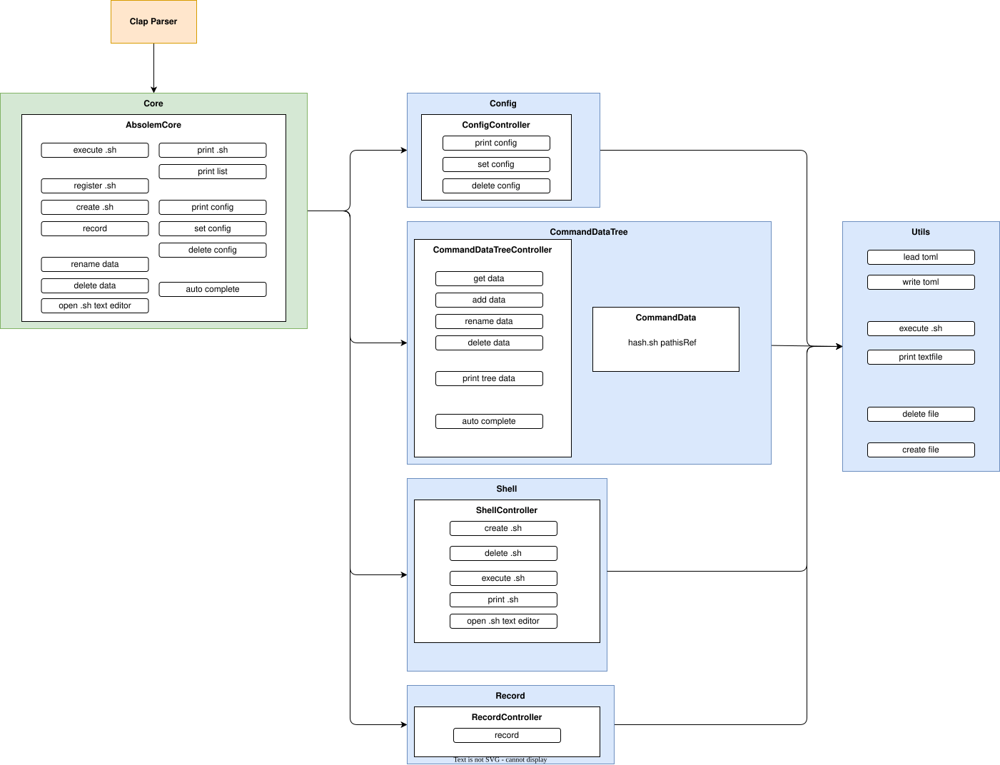

<div align="center" style="margin: 20px 0;">
    
</div>

<div align="center">

**Absolem** is a command-line tool for managing your shell scripts.  
Create, organize, and execute them with ease.

</div>

# Develop
- use vscode devcontainer
-```reopen in container```

# System Design


# Usage
TBD